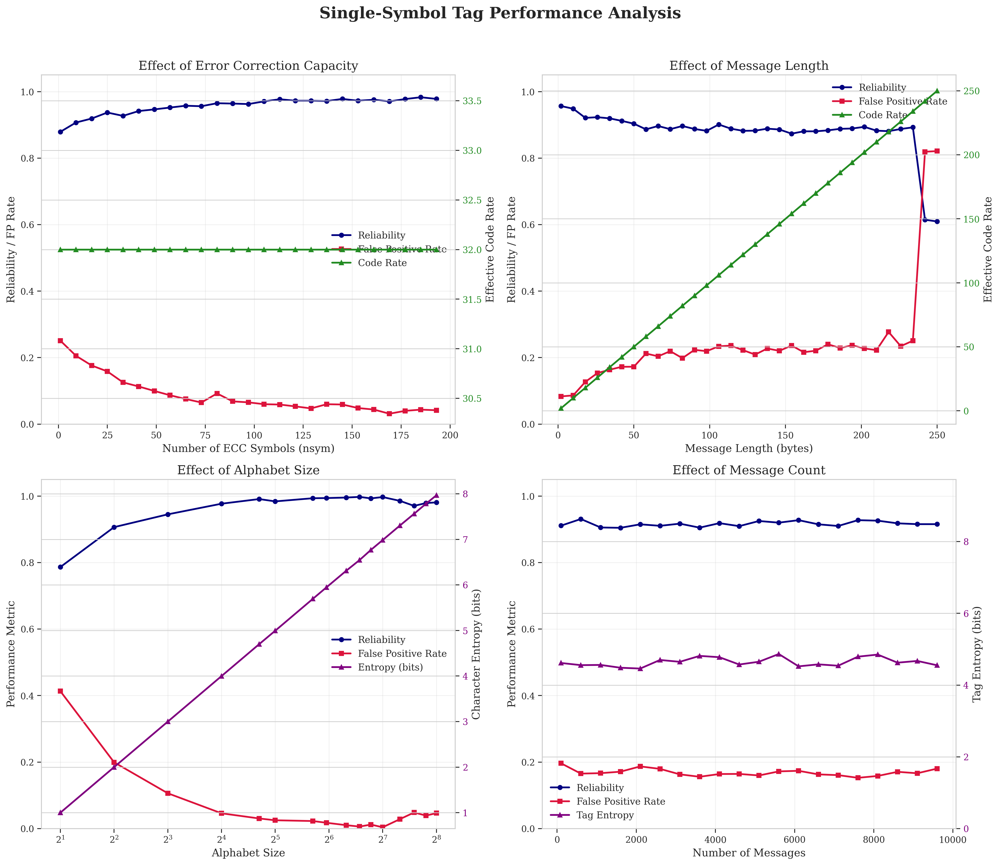
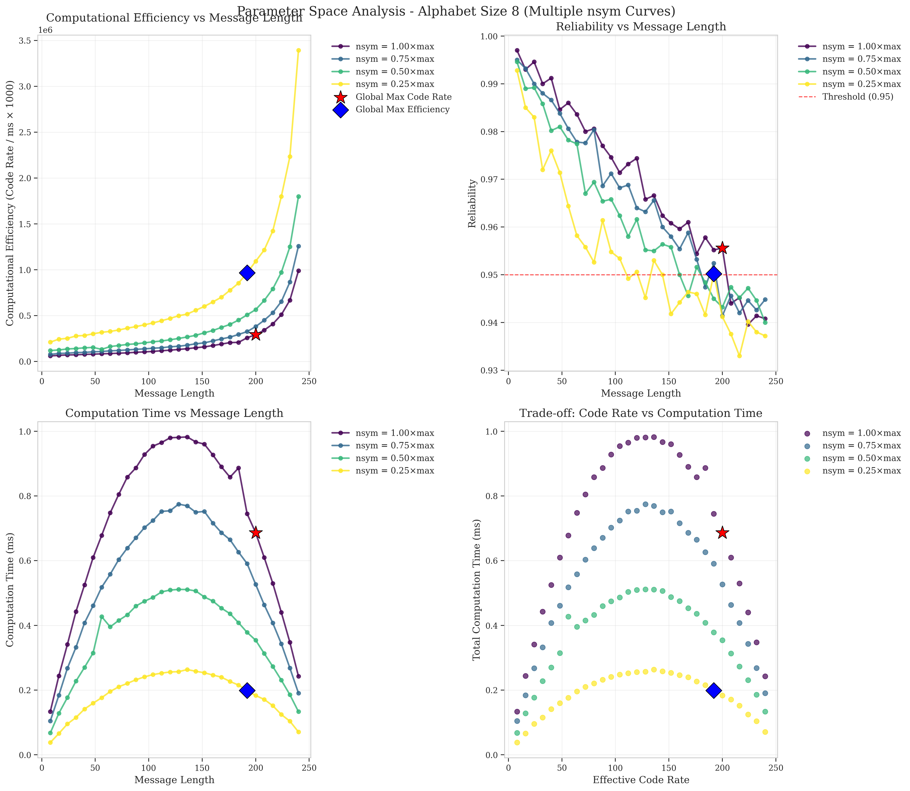
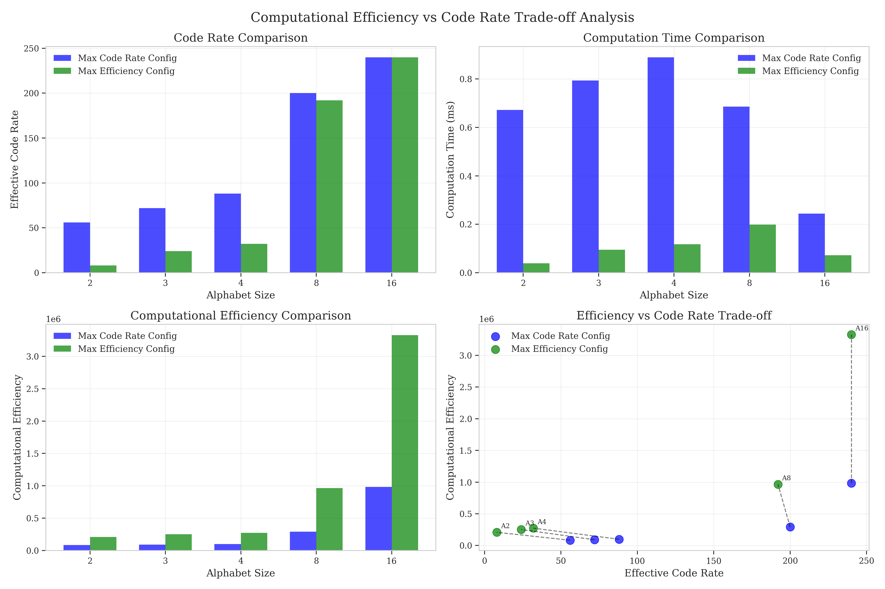
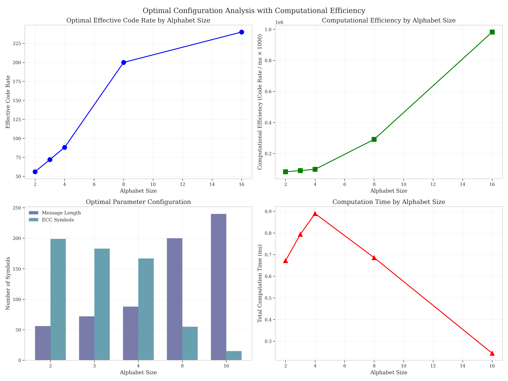

# Identification System Framework

A comprehensive Python framework for creating, evaluating, and visualizing identification systems. This framework provides tools for implementing various identification coding schemes, measuring their performance, and optimizing their computational efficiency through detailed parameter space analysis.

## Overview

Identification systems are communication systems where a sender (Alice) encodes a message, and a receiver (Bob) needs to determine whether the received codeword corresponds to a specific message. This differs from traditional communication where Bob needs to decode which message was sent.

This framework implements:

1. Different identification system encoding schemes (e.g., Reed-Solomon-based tagging)
2. Metrics for evaluating performance (reliability, error rates, collision probability, efficiency)
3. Advanced visualization tools for analysis and parameter optimization
4. Computational efficiency analysis to evaluate real-world performance
5. Multi-parameter optimization across alphabet sizes and ECC configurations

## Structure

The framework consists of the following components:

- `core.py`: Base classes and implementations for identification systems (e.g., PaperTaggingEncoder)
- `metrics.py`: Functions for measuring system performance
- `utils.py`: Utility functions for visualization and testing
- `analyze_single_symbol_tag.py`: In-depth analysis of single-symbol tag performance
- `system_comparison.py`: Comprehensive system optimization across parameters

## Usage

### Creating an Identification System

```python
from framework import create_id_system, utils

# Create a Reed-Solomon-based identification system
rs_system = create_id_system("paper_tagging", {
    "message_length": 64,
    "nsym": 16,
    "code_length": 1
})

# Generate test messages
messages = utils.generate_test_messages(count=100, length=64, alphabet_size=4)
```

### Evaluating System Performance

```python
from framework import IdMetrics

# Calculate reliability and measure computation time
reliability, avg_time = measure_computation_time_from_reliability(rs_system, messages, num_trials=1000)
print(f"System reliability: {reliability:.4f}")
print(f"Average operation time: {avg_time:.4f} ms")

# Calculate error rates
error_rates = IdMetrics.error_rates(rs_system, messages, num_trials=500)
print(f"False positive rate: {error_rates['false_positive_rate']:.4f}")
print(f"False negative rate: {error_rates['false_negative_rate']:.4f}")

# Calculate efficiency metrics
efficiency = IdMetrics.efficiency(rs_system)
print(f"Effective code rate: {efficiency['effective_code_rate']:.4f}")

# Calculate computational efficiency
computational_efficiency = efficiency['effective_code_rate'] / avg_time * 1000
print(f"Computational efficiency: {computational_efficiency:.2f}")
```

## Running Analysis Scripts

The framework includes specialized scripts for analyzing different aspects of identification systems:

```powershell
# Run single symbol tag analysis
python analyze_single_symbol_tag.py

# Run system comparison and optimization
python system_comparison.py
```

These scripts generate comprehensive performance visualizations in the respective output directories.

## Key Visualization Examples

| System Performance Overview | Parameter Optimization Analysis |
|----------------------------|----------------------------------|
|  |  |
| **Trade-off Analysis** | **Optimal Configuration Analysis** |
|  |  |

- **Single-Symbol Tag Performance Analysis**: Shows the effects of error correction, message length, alphabet size, and message count on system performance.
- **Parameter Space Analysis**: Explores multiple nsym curves to find optimal configurations that balance reliability and computational efficiency.
- **Trade-off Analysis**: Compares max code rate and max efficiency configurations across alphabet sizes.
- **Optimal Configuration Analysis**: Shows optimized parameters and computational metrics for different alphabet sizes.

## Components

### Encoders

- **PaperTaggingEncoder**: Uses Reed-Solomon codes for robust identification with configurable ECC symbols

### Decoders

- **PaperTaggingDecoder**: Verifies tags using Reed-Solomon code structure

### Metrics

- **Reliability**: Probability of correct identification
- **Error Rates**: False positive and false negative rates
- **Collision Probability**: Likelihood of messages being confused
- **Efficiency**: Code rate and encoding time
- **Computational Efficiency**: Performance metric balancing code rate and computation time

### Visualization Tools

- Parameter space exploration with multiple curves
- Trade-off analysis between code rate and computation time
- Computational efficiency analysis
- Comprehensive performance dashboards

## References

For more information about identification coding, refer to the literature in the `literature/` folder.