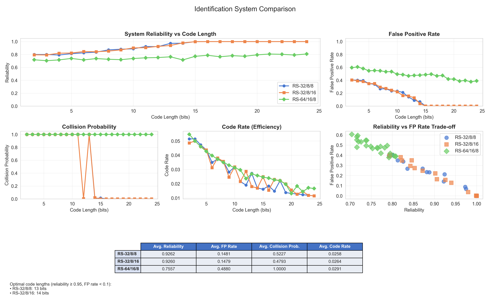
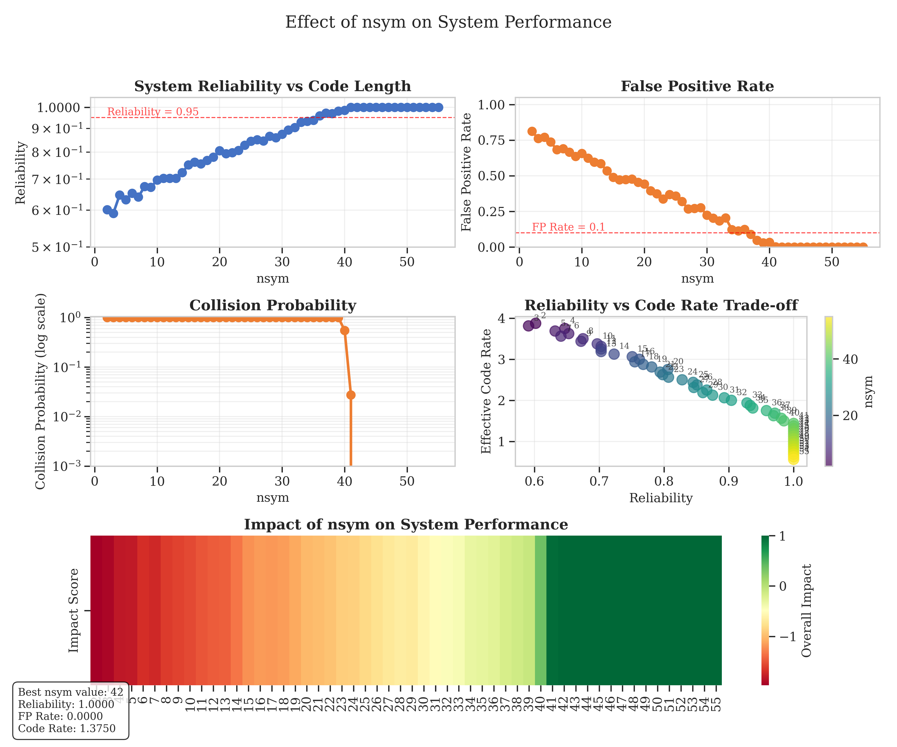
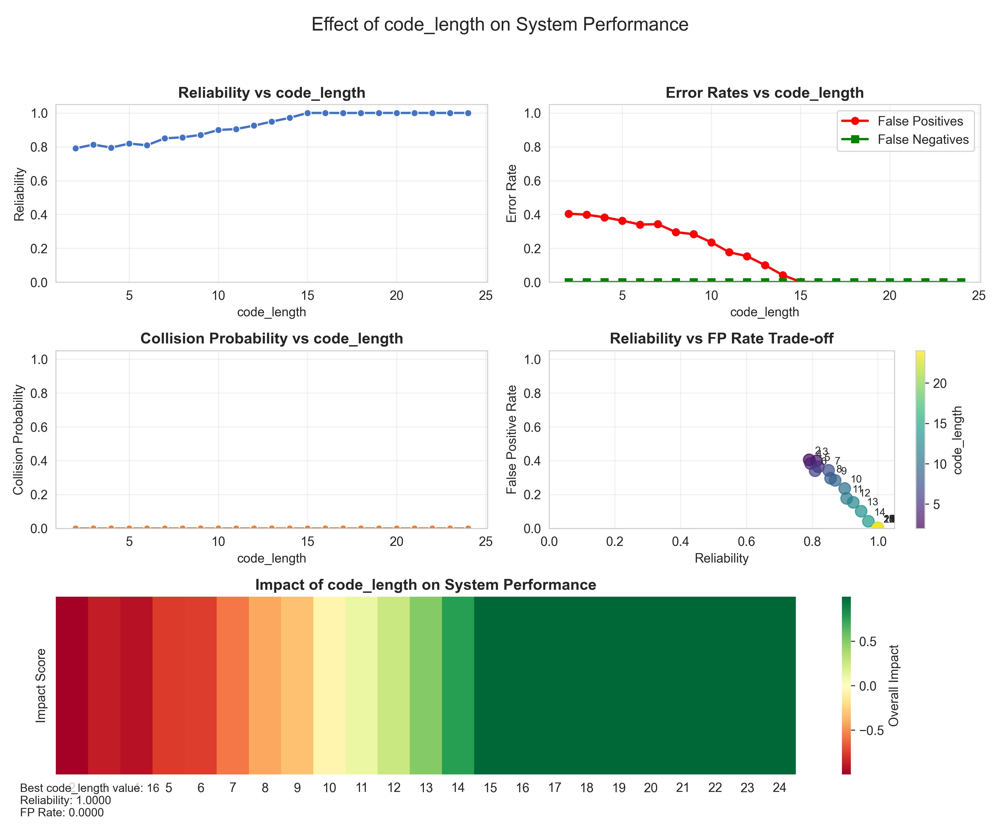
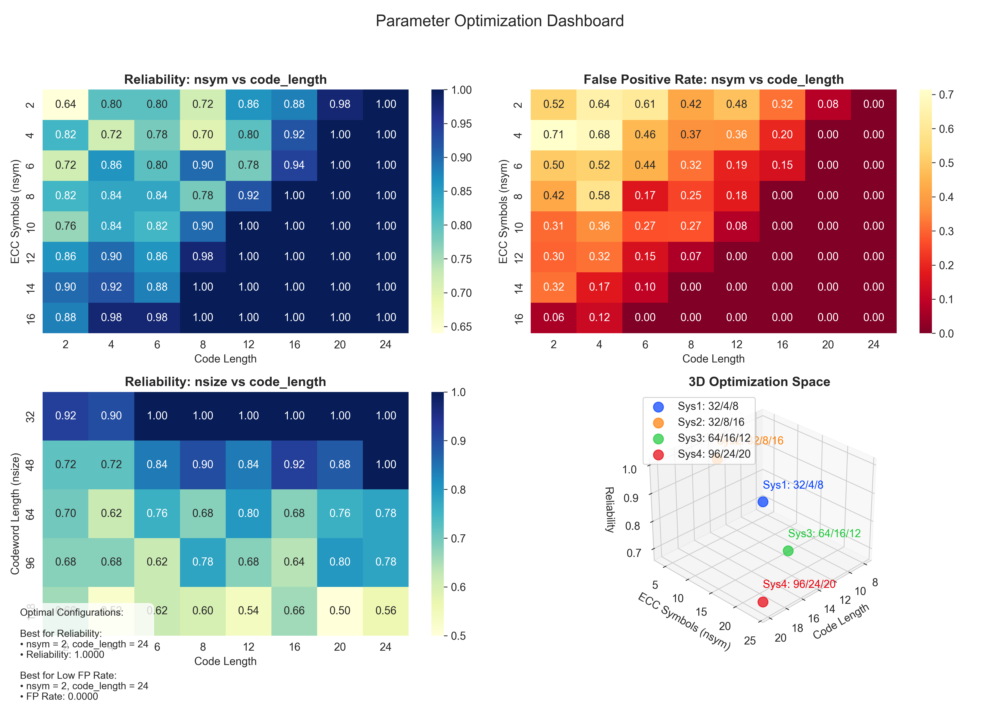

# Identification System Framework

A comprehensive Python framework for creating, evaluating, and visualizing identification systems. This framework provides tools for implementing various identification coding schemes, measuring their performance, and analyzing the results through visualizations.

## Overview

Identification systems are communication systems where a sender (Alice) encodes a message, and a receiver (Bob) needs to determine whether the received codeword corresponds to a specific message. This differs from traditional communication where Bob needs to decode which message was sent.

This framework implements:

1. Different identification system encoding schemes (e.g., Reed-Solomon-based tagging)
2. Metrics for evaluating performance (reliability, error rates, collision probability, efficiency)
3. Advanced visualization tools for analysis and parameter optimization
4. Testing utilities and correctness validation

## Structure

The framework consists of the following components:

- `core.py`: Base classes and implementations for identification systems (e.g., PaperTaggingEncoder)
- `metrics.py`: Functions for measuring system performance
- `example_identification.py`: Comprehensive example script showing framework usage and generating all evaluation plots

## Usage

### Creating an Identification System

```python
from framework import create_id_system, generate_string_messages

# Create a Reed-Solomon-based identification system
rs_system = create_id_system("paper_tagging", {"nsize": 32, "nsym": 8, "code_length": 8})

# Generate test messages
messages = generate_string_messages(count=10, length=10)
```

### Evaluating System Performance

```python
from framework import IdMetrics

# Calculate reliability
reliability = IdMetrics.reliability(rs_system, messages, num_trials=1000)
print(f"System reliability: {reliability:.4f}")

# Calculate error rates
error_rates = IdMetrics.error_rates(rs_system, messages, num_trials=500)
print(f"False positive rate: {error_rates['false_positive_rate']:.4f}")
print(f"False negative rate: {error_rates['false_negative_rate']:.4f}")

# Calculate worst-case collision probability
collision_prob = IdMetrics.worst_case_collision_probability(
    rs_system, messages, sample_size=10, num_trials=100
)
print(f"Worst-case collision probability: {collision_prob:.4f}")

# Calculate efficiency metrics
efficiency = IdMetrics.efficiency(rs_system)
print(f"Code rate: {efficiency['code_rate']:.4f}")
print(f"Encoding time: {efficiency['encoding_time_ms']:.4f} ms")
```


## Running the Example Script

The `example_identification.py` script demonstrates how to use the framework and will generate all evaluation plots:

```powershell
python example_identification.py
```

This will run a comprehensive analysis of different identification systems, including:
- Comparison of multiple identification schemes
- Parameter effect analysis
- Parameter optimization dashboard
- Creation of visualization dashboards

The example script will save visualization results as PNG files in the `output/` directory.

## Output Evaluation Images

The following images are generated by the example script and provide a visual summary of system performance and parameter effects:

| System Comparison | Parameter Effects (nsym) | Parameter Effects (code_length) | Parameter Optimization Dashboard |
|-------------------|-------------------------|----------------------------------|----------------------------------|
|  |  |  |  |

- **system_comparison.png**: Compares reliability, false positive rate, collision probability, and code rate for different system configurations.
- **parameter_effects_nsym.png**: Shows how the number of ECC symbols (nsym) affects reliability and error rates.
- **parameter_effects_code_length.png**: Shows how the code length parameter affects system performance.
- **parameter_optimization_dashboard.png**: Heatmaps and 3D plots for optimal parameter selection.

## Components

### Encoders

- **PaperTaggingEncoder**: Uses Reed-Solomon codes for robust identification

### Decoders

- **PaperTaggingDecoder**: Verifies tags using Reed-Solomon code structure

### Metrics

- **Reliability**: Probability of correct identification
- **Error Rates**: False positive and false negative rates
- **Collision Probability**: Likelihood of messages being confused
- **Efficiency**: Code rate and encoding time

### Visualization Tools

- Individual metric plots
- Parameter sweep visualizations
- Comprehensive dashboards
- Comparison between systems
- Parameter optimization heatmaps

## References

For more information about identification coding, refer to the literature in the `literature/` folder.
