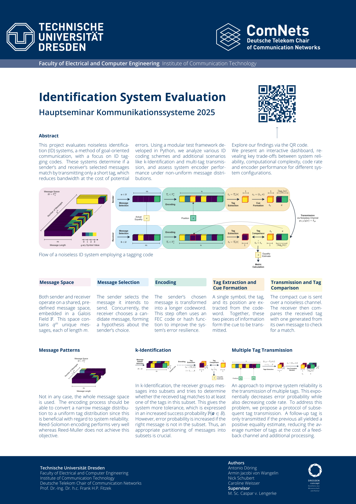

# IDSYS: Identification Systems Analysis Framework

IDSYS is a comprehensive framework for creating, evaluating, and benchmarking identification systems based on various coding schemes. It provides tools to analyze performance, reliability, and efficiency across multiple parameters.

## Overview

The framework implements and evaluates several identification systems:

- Reed-Solomon Identification (RSID)
- Concatenated Reed-Solomon Identification (RS2ID)
- Reed-Muller Identification (RMID)
- Cryptographic hash-based identification (SHA1ID, SHA256ID)
- Baseline system for comparison (NoCode)

IDSYS allows systematic analysis of these systems across different parameters including Galois field sizes, message lengths, tag positions, and message patterns, with built-in support for checkpointing long-running analyses.

## Installation

### Regular Installation

```bash
# Clone the repository
git clone https://github.com/yourusername/idsys.git
cd idsys

# Install dependencies
pip install -r requirements.txt

# Install the package in development mode
pip install -e .
```

### Using Dev Container

The repository includes a dev container configuration for VS Code:

1. Install the [Dev Containers extension](https://marketplace.visualstudio.com/items?itemName=ms-vscode-remote.remote-containers)
2. Ensure Docker is running
3. Open the repository in VS Code
4. Click "Reopen in Container" when prompted
5. The container will install all dependencies automatically

See devcontainer_quickstart.md for more details.

## Directory Structure

```
idsys/
├── src/                   # Source code
│   └── idsys/             # Main package
│       ├── core/          # Core functionality
│       ├── utils/         # Utility modules
│       └── dashboard/     # Visualization dashboards
├── examples/              # Example code
│   ├── ecidcodes/         # Examples for ecidcodes
│   └── idsys/             # Examples for idsys
├── analyses/              # Analysis scripts
│   ├── main/              # Main scripts we used for evaluating ID systems
│   └── research/          # Deprecated scripts we used for research and troubleshooting
├── tests/                 # Test scripts
├── scripts/               # Utility scripts
└── .devcontainer/        # Dev container configuration
```

## Core Concepts

### Identification Systems

An identification system consists of an encoder (generates tags from messages) and a verifier (validates tags against messages):

```python
from idsys import create_id_system

# Create an RS identification system
rsid = create_id_system("RSID", {"gf_exp": 8, "tag_pos": [2]})

# Encode a message
tag = rsid.send(message)

# Verify a message against a tag
is_valid = rsid.receive(tag, message)
```

### Message Generation

Generate test messages with various patterns:

```python
from idsys import generate_test_messages, generate_structured_messages

# Generate random messages
messages = generate_test_messages(vec_len=16, gf_exp=8, count=100)

# Generate structured messages with specific patterns
structured_msgs = list(generate_structured_messages(
    vec_len=16,
    pattern_type="repeated_patterns",  # Options: random, incremental, repeated_patterns, sparse, low_entropy, only_two
    gf_exp=8,
    target_count=100
))
```

### Metrics and Evaluation

Evaluate system performance with comprehensive metrics:

```python
from idsys import IdMetrics

# Evaluate a single system
metrics = IdMetrics.evaluate_system(
    system=rsid,
    vec_len=16,
    num_messages=10000
)

# Key metrics:
fp_rate = metrics["false_positive_rate"]
code_rate = metrics["code_rate_bulk"]
execution_time = metrics["avg_execution_time_ms"]
throughput = metrics["throughput_msgs_per_sec"]
```

### Checkpointing for Long Analyses

For long-running analyses, use checkpointing for automatic resume capability:

```python
from idsys import create_checkpoint_manager

# Create checkpoint manager
checkpoint = create_checkpoint_manager(
    output_dir="output/my_analysis",
    analysis_name="parameter_sweep",
    save_interval=10
)

# Initialize with all parameter sets to test
remaining_params = checkpoint.initialize_analysis(parameter_sets)

# Process each parameter combination
for params in remaining_params:
    result = analyze_single_combination(params)
    checkpoint.add_result(params, result)

# Finalize and get results
checkpoint.finalize_analysis()
results_df = checkpoint.get_results_dataframe()
```

## Examples

The idsys directory contains ready-to-use examples:

### Basic Usage

```bash
python examples/idsys/minimal_example.py
```

Demonstrates creating a system, generating messages, and basic identification operations.

### System Comparison

```bash
python examples/idsys/system_comparison.py
```

Compares multiple identification systems side-by-side.

### Parallel Processing

```bash
python examples/idsys/parallel.py
```

Shows how to leverage parallel processing for performance.

### Checkpointing and Resume

```bash
python examples/idsys/resume_functionality.py
```

Demonstrates checkpoint/resume functionality for handling interruptions in long analyses.

## Analysis Scripts

The analyses directory contains scripts for comprehensive system evaluation:

### Comprehensive Benchmark

```bash
python analyses/main/system_evaluation/evaluation.py
```

Evaluates systems across multiple dimensions:
- System types (RSID, RS2ID, RMID, SHA1ID, SHA256ID)
- Galois field exponents (8, 16, 32, 64)
- Vector lengths (8 to 65536)
- Message patterns (random, sparse, low_entropy, etc.)

### Message Pattern Analysis

```bash
python analyses/main/message_patterns/pdf.py
```

Analyzes collision behavior between random and structured messages across different system types.

## Interactive Dashboard

IDSYS includes a Streamlit dashboard for visualizing results:

```bash
cd src/idsys/dashboard
streamlit run dashboard_streamlit.py
```

The dashboard provides interactive exploration of:
- False positive rates across systems
- Execution time comparisons
- System type comparisons
- Probability distribution functions & examples

## Advanced Features

### Parallel Processing

For large-scale evaluations, IDSYS automatically utilizes multiple CPU cores:

```python
# Auto-detect optimal number of processes
metrics = IdMetrics.evaluate_system(
    system=system,
    num_messages=1000000,
    num_processes=None  # Auto-select based on CPU cores
)
```

### Message Patterns

Test identification systems with various message patterns:

- `random`: Uniformly random byte values
- `incremental`: Sequence of zeros with incrementing last byte
- `repeated_patterns`: Short, repeating byte patterns
- `sparse`: Mostly zeros with few non-zero bytes
- `low_entropy`: Limited alphabet `[0,1,2,3]` 
- `only_two`: Only two distinct messages exist

## License

This project is licensed under the MIT License - see the LICENSE file for details.

## Acknowledgments

This framework utilizes the `ecidcodes` library for implementing identification codes.

